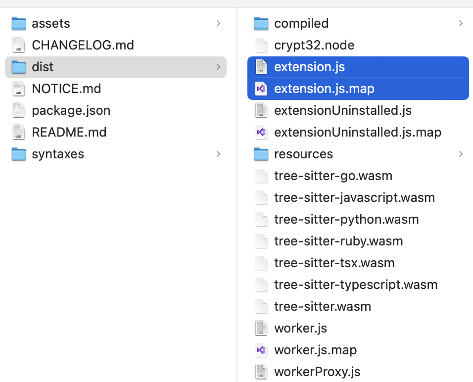

# 再次揭秘Copilot：sourcemap逆向分析

## 源码详细分析
- [copilot源码详细分析（一）从package.json说起](./docs/copilot源码详细分析（一）从package.json说起.md)
- [copilot源码详细分析（二）activate入口分析](./docs/copilot源码详细分析（二）activate入口分析.md)

## 背景

今年五月的时候我写了一篇文章《**[花了大半个月，我终于逆向分析了Github Copilot](https://mp.weixin.qq.com/s?__biz=Mzk0ODM5NTEyNA==&amp;mid=2247484980&amp;idx=1&amp;sn=240c76200248bc35101710683a516ff6&amp;chksm=c3690b2ff41e82399f6de726204d075d0b28313019e34cedc5608c93907488be2ce61ff375e5&token=840731485&lang=zh_CN#rd)**》，最近发现`copilot`将`.map`文件也提交了上来，**`sourcemap`**中包含了整体源码的结构信息和部分变量信息，这无疑为分析`copilot`源码带来了极大的便利，因此再次分析一波。



## sourcemap是什么

`Sourcemap` 是一种用于将编译、打包后的代码映射回原始源代码的技术。它主要用于 JavaScript 的源代码映射（source map），但也可以用于其他编程语言。

在 JavaScript 中，源代码映射（source map）是一种文件，它允许浏览器将压缩、混淆或转译后的代码映射回原始源代码。这对于调试非常有用，因为它允许开发者查看和调试原始源代码，而不是被压缩或混淆的代码。

`Sourcemap` 文件通常以 `.map` 扩展名结尾，并且可以通过浏览器的开发者工具查看和使用。

## sourcemap的结构

Sourcemap 文件的结构主要包括以下几个部分：

1. **Version**: 这是源映射文件的版本号。目前，Sourcemap 的版本号为 3。
2. **File**: 这是源映射文件所对应的原始源文件的名称。
3. **SourceRoot**: 这是一个可选的字段，它指定了源文件的根路径。
4. **Sources**: 这是一个包含所有原始源文件名的数组。
5. **Names**: 这是一个包含所有原始源文件中使用的变量、函数和类的名称的数组。
6. **Mappings**: 这是一个字符串，它描述了源文件和生成文件之间的映射关系。

下面是一个简单的 Sourcemap 文件的示例：

```
{
  "version": 3,
  "file": "out.js",
  "sourceRoot": "",
  "sources": ["foo.js", "bar.js"],
  "names": ["src", "maps", "are", "fun"],
  "mappings": "AAAA,SAASA,EAAM,CAAE,GAAG,EAAE,CACC,CAAC"
}
```

在这个示例中，`mappings` 字段描述了源文件和生成文件之间的映射关系。这个字符串被分成多个部分，每个部分对应源文件的一行。每个部分由一系列的映射组成，每个映射描述了源文件中的一个字符在生成文件中的位置。

## mappings的含义

`Sourcemap` 的 `mappings` 字段是一个字符串，它描述了源文件和生成文件之间的映射关系。这个字符串被分成多个部分，每个部分对应源文件的一行。每个部分由一系列的映射组成，每个映射描述了源文件中的一个字符在生成文件中的位置。

每个映射由五个部分组成：

1. 生成文件中的列号。
2. 源文件中的行号。
3. 源文件中的列号。
4. 源文件中的名称索引。
5. 源文件中的名称。

每个部分都使用 VLQ（Variable-length quantity）编码，这是一种压缩数字的方法。VLQ 编码使用一个或多个字节来表示一个数字，每个字节的最高位用于指示是否还有更多的字节需要读取。

下面是一个 `mappings` 字段的示例：

```
AAAA,SAASA,EAAM,CAAE,GAAG,EAAE,CACC,CAAC
```

在这个示例中，`AAAA` 表示生成文件中的第一列对应源文件的第一行第一列，`SAASA` 表示生成文件中的第二列对应源文件的第二行第二列，以此类推。

## source-map库获取源文件信息

Node.js的source-map库可以做map文件的解析：

```jsx
const sourcemap = require("source-map");

const mapFile = fs.readFileSync("./extension.js.map");
const rawSourceMap = JSON.parse(mapFile.toString());

const nameMap = new Map();
const fileMap = new Map();

await sourcemap.SourceMapConsumer.with(rawSourceMap, null, (consumer) => {
  consumer.eachMapping(function (m) {
    if (m.name) {
      nameMap.set(`${m.generatedLine}:${m.generatedColumn}`, m);
    }

    if (m.source) {
      if (!fileMap.has(m.source)) {
        fileMap.set(m.source, {
          start: m,
        });
      } else {
        fileMap.set(m.source, {
          ...fileMap.get(m.source),
          end: m,
        });
      }
    }
  });
});
```

上面我们使用`source-map`工具解析了变量名的映射关系以及对应的源文件路径信息，将解析的结果存在了两个`map`当中，便于我们后面进行读取。

## AST处理节点命名

```jsx
function updateNodeName(node, name) {
  if (node.type === "VariableDeclarator") {
    node.id.name = name;
  } else if (node.type === "Identifier") {
    node.name = name;
  } else if (node.type === "CallExpression") {
    updateNodeName(node.callee, name);
  } else if (node.type === "ArrowFunctionExpression") {
    node.params[0].name = name;
  } else if (node.type === "ExpressionStatement") {
    updateNodeName(node.expression, name);
  } else if (node.type === "AssignmentExpression") {
    updateNodeName(node.left, name);
  } else if (node.type === "MemberExpression") {
    updateNodeName(node.object, name);
  } else if (node.type === "BinaryExpression") {
    updateNodeName(node.left, name);
  } else if (node.type === "ConditionalExpression") {
    updateNodeName(node.test, name);
  } else if (node.type === "LogicalExpression") {
    updateNodeName(node.left, name);
  } else if (node.type === "SequenceExpression") {
    updateNodeName(node.expressions[0], name);
  } else if (node.type === "UpdateExpression") {
    updateNodeName(node.argument, name);
  } else if (node.type === "StringLiteral") {
    node.value = name;
  } else if (node.type === "AssignmentPattern") {
    updateNodeName(node.left, name);
  } else if (node.type === "ReturnStatement") {
    updateNodeName(node.argument, name);
  } else if (node.type === "BlockStatement") {
    updateNodeName(node.body[0], name);
  } else if (node.type === "UnaryExpression") {
    updateNodeName(node.argument, name);
  } else if (node.type === "ObjectProperty") {
    updateNodeName(node.key, name);
  } else if (node.type === "EmptyStatement") {
    // 好像是start和end标记
    // console.log(name);
  } else if (node.type === "NumericLiteral") {
    node.value = name;
  } else if (node.type === "ThisExpression") {
    // console.log(name);
  } else if (node.type === "ForStatement") {
    updateNodeName(node.init, name);
  } else if (node.type === "OptionalMemberExpression") {
    updateNodeName(node.object, name);
  } else if (node.type === "OptionalCallExpression") {
    updateNodeName(node.callee, name);
  } else if (node.type === "LabeledStatement") {
    updateNodeName(node.label, name);
  } else if (node.type === "ClassPrivateProperty") {
    updateNodeName(node.key, name);
  } else if (node.type === "PrivateName") {
    updateNodeName(node.id, name);
  } else if (node.type === "ClassPrivateMethod") {
    updateNodeName(node.key, name);
  } else if (node.type === "VariableDeclaration") {
    updateNodeName(node.declarations[0], name);
  } else if (node.type === "IfStatement") {
    updateNodeName(node.test, name);
  } else if (node.type === "TryStatement") {
    updateNodeName(node.block, name);
  } else if (node.type === "SwitchStatement") {
    updateNodeName(node.discriminant, name);
  } else {
    // console.log(node);
  }
}
```

我们封装了一个`updateNodeName`的方法，用于递归处理`AST`节点将变量命名给替换（这着实是一个体力活。。。），判断了各类表达式、语句、字面量等等场景。

## AST映射源文件路径

对于文件路径我们怎样映射过去呢？目前已知的信息主要有：

- 对应源代码的`location`
- 对应源代码的`path`
- 所有具有映射关系的`map`

一个比较自然的想法是基于代码的位置做字符切割。但是我们上面变量命名替换后，生成的新的代码文件行号和列号都已经发生了变化，无法映射到原来的行列，这条路很难行的通。

所以还是在`AST`遍历里面处理完比较好。

我们使用两个变量分别记录上一次遍历的文件路径和`ast`的`nodes`：

```jsx
let lastFile;
let lastNodes = [];
```

然后对AST进行遍历，先处理变量命名：

```jsx
traverse(ast, {
    enter(p) {
      const node = p.node;
      const { line, column } = node.loc.start;
      
      // 处理变量命名
      if (nameMap.has(`${line}:${column}`)) {
        const sourceObj = nameMap.get(`${line}:${column}`);
        const name = sourceObj.name;
        updateNodeName(node, name);
      }
    },
  });
```

再处理路径：

```jsx
traverse(ast, {
    enter(p) {
      const node = p.node;
      const { line, column } = node.loc.start;

      // 处理路径
      for (const [file, m] of fileMap.entries()) {
        if (
          m.start.generatedLine === line &&
          m.start.generatedColumn === column
        ) {
          if (lastFile && lastNodes.length) {
            const pp = path.resolve(__dirname, "./prettier/empty", lastFile);
            fs.ensureFileSync(pp);
            fs.writeFileSync(pp, lastNodes.map(n => generate(n).code).join());
            lastNodes = [];
          }
          lastFile = file;
          break;
        }
      }
      if (lastFile) {
        lastNodes.push(node);
        p.skip();
      }
    },
  });
```

注意这里的思路是每当`start`起始对应的文件路径发生变化的时候，生成上一个文件的源码，然后写入到对应的目录文件内。

另外ast是进行数组拼接的，我们需要通过`skip`方法防止`children`元素再次被递归到造成代码重复。

## copilot的源码结构

最终得到的还原代码如下：

```jsx
├── extension
│   └── src
│       ├── auth.ts
│       ├── codeReferencing
│       │   ├── codeReferenceEngagementTracker.ts
│       │   ├── compute.ts
│       │   ├── connectionState.ts
│       │   ├── constants.ts
│       │   ├── handleCopliotToken.ts
│       │   ├── handlePostInsertion.ts
│       │   ├── headerContributor.ts
│       │   ├── index.ts
│       │   ├── logger.ts
│       │   ├── matchNotifier.ts
│       │   ├── outputChannel.ts
│       │   ├── snippy
│       │   │   ├── errorCreator.ts
│       │   │   ├── index.ts
│       │   │   ├── network.ts
│       │   │   └── snippy.proto.ts
│       │   └── telemetry
│       │       └── handlers.ts
│       ├── config.ts
│       ├── constants.ts
│       ├── copilotPanel
│       │   ├── common.ts
│       │   ├── copilotListDocument.ts
│       │   └── panel.ts
│       ├── diagnostics.ts
│       ├── experiments
│       │   └── expFilters.ts
│       ├── extension.ts
│       ├── extensionStatus.ts
│       ├── extensionTestApi.ts
│       ├── fileSystem.ts
│       ├── ghostText
│       │   └── ghostText.ts
│       ├── git.ts
│       ├── install
│       │   └── installationManager.ts
│       ├── networkConfiguration.ts
│       ├── proxy.ts
│       ├── session.ts
│       ├── statusBar.ts
│       ├── statusBarPicker.ts
│       ├── suggestions.ts
│       ├── symbolDefinitionProvider.ts
│       ├── telemetry.ts
│       ├── telemetryDelegation.ts
│       ├── textDocument.ts
│       ├── textDocumentManager.ts
│       └── vscodeCommitFileResolver.ts
├── lib
│   └── src
│       ├── auth
│       │   ├── copilotToken.ts
│       │   ├── copilotTokenManager.ts
│       │   ├── copilotTokenNotifier.ts
│       │   └── error.ts
│       ├── changeTracker.ts
│       ├── clock.ts
│       ├── commitFileResolver.ts
│       ├── common
│       │   ├── cache.ts
│       │   ├── debounce.ts
│       │   ├── iterableHelpers.ts
│       │   └── productContext.ts
│       ├── config.ts
│       ├── constants.ts
│       ├── context.ts
│       ├── copilotPanel
│       │   ├── common.ts
│       │   └── panel.ts
│       ├── cursorHistoryManager.ts
│       ├── defaultHandlers.ts
│       ├── diagnostics.ts
│       ├── documentTracker.ts
│       ├── error
│       │   └── userErrorNotifier.ts
│       ├── experiments
│       │   ├── defaultExpFilters.ts
│       │   ├── expConfig.ts
│       │   ├── features.ts
│       │   ├── fetchExperiments.ts
│       │   ├── filters.ts
│       │   ├── granularityDirectory.ts
│       │   └── granularityImplementation.ts
│       ├── ghostText
│       │   ├── completionsCache.ts
│       │   ├── contextualFilter.ts
│       │   ├── contextualFilterConstants.ts
│       │   ├── contextualFilterTree.ts
│       │   ├── copilotCompletion.ts
│       │   ├── debounce.ts
│       │   ├── ghostText.ts
│       │   ├── multilineModel.ts
│       │   ├── multilineModelWeights.ts
│       │   ├── normalizeIndent.ts
│       │   └── telemetry.ts
│       ├── headerContributors.ts
│       ├── installationManager.ts
│       ├── language
│       │   ├── generatedLanguages.ts
│       │   ├── languageDetection.ts
│       │   └── languages.ts
│       ├── logger.ts
│       ├── network
│       │   ├── certificateReaderCache.ts
│       │   ├── certificateReaders.ts
│       │   ├── certificates.ts
│       │   ├── helix.ts
│       │   ├── proxy.ts
│       │   └── proxySockets.ts
│       ├── networkConfiguration.ts
│       ├── networking.ts
│       ├── notificationSender.ts
│       ├── openai
│       │   ├── config.ts
│       │   ├── fetch.fake.ts
│       │   ├── fetch.ts
│       │   ├── openai.ts
│       │   └── stream.ts
│       ├── postInsertion.ts
│       ├── postInsertionNotifier.ts
│       ├── progress.ts
│       ├── prompt
│       │   ├── neighborFiles
│       │   │   ├── cocommittedFiles.ts
│       │   │   ├── cursorHistoryFiles.ts
│       │   │   ├── neighborFiles.ts
│       │   │   ├── openTabFiles.ts
│       │   │   └── workspaceFiles.ts
│       │   ├── parseBlock.ts
│       │   ├── prompt.ts
│       │   ├── promptLibProxy.ts
│       │   ├── repository.ts
│       │   ├── retrieval.ts
│       │   └── symbolDefinition.ts
│       ├── repositoryControl
│       │   ├── constants.ts
│       │   ├── contentRestrictions.ts
│       │   ├── policyEvaluator.ts
│       │   ├── repositoryControl.ts
│       │   └── repositoryControlManager.ts
│       ├── suggestions
│       │   ├── anomalyDetection.ts
│       │   ├── editDistance.ts
│       │   ├── mlConstants.ts
│       │   ├── restraint.ts
│       │   └── suggestions.ts
│       ├── telemetry
│       │   ├── auth.ts
│       │   ├── azureInsights.ts
│       │   ├── azureInsightsReporter.ts
│       │   ├── failbot.ts
│       │   └── userConfig.ts
│       ├── telemetry.ts
│       ├── testing
│       │   ├── config.ts
│       │   ├── copilotToken.ts
│       │   ├── packageRoot.ts
│       │   ├── runtimeMode.ts
│       │   ├── telemetry.ts
│       │   ├── telemetryFake.ts
│       │   ├── testHelpers.ts
│       │   └── tokenManager.ts
│       ├── textDocument.ts
│       ├── textDocumentManager.ts
│       ├── util
│       │   ├── documentEvaluation.ts
│       │   ├── nodeVersion.ts
│       │   ├── opener.ts
│       │   ├── redaction.ts
│       │   ├── shortCircuit.ts
│       │   └── typebox.ts
│       └── workspaceFileSystem.ts
├── package.json
└── prompt
    └── src
        ├── elidableText
        │   └── index.ts
        └── tokenization
            └── index.ts
```

可以看到，`copilot`源码大体结构上就是`extension`和`lib`两层，`extension`是整个插件的入口，`lib`是底层封装的基础能力，在这个清晰的源码结构上，有助于我们进一步分析理解其中的逻辑。

上述代码已经提交在Github上，有需要的小伙伴可自取：

https://github.com/mengjian-github/copilot-analysis-new

## 小结一下

其实目前的copilot版本webpack混淆压缩要比之前更加难以分析，整个模块信息基本上无法拆离出来了，甚至是他们之间的依赖关系也变得更加模糊。不过copilot团队暴露了sourcemap文件，又可以进一步探求源码的结构和替换一些关键变量，为分析带来了一定的便利。

本文没有像之前那样将主流程再分析一遍，实际上，虽然代码组织结构清晰了，但是源码依旧无法完美还原，sourcemap其实帮助也有限，很多映射还需要不断对比生成代码进行推敲分析，基于这个版本的基础，要想深入了解，还是需要大量的时间和精力推导内在的逻辑实现。